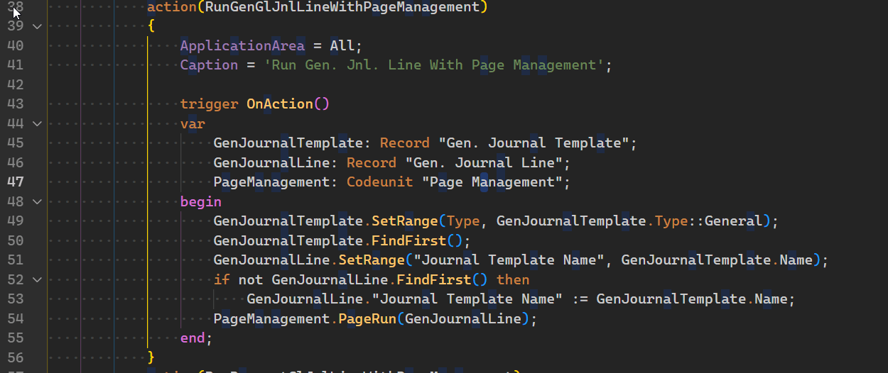
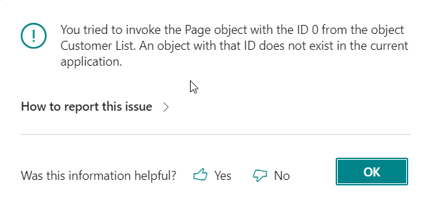

## Introduction

Most Business Central developers are familiar with the `Page.Run()` procedure. By providing zero as the page number and a Record variable, you can run the Lookup Page defined for that record. For example, running the Item Lookup page:

<!--more-->

```al
action(RunItem)
{
    ApplicationArea = All;
    Caption = 'Run Item';

    trigger OnAction()
    var
        RecAsVariant: Variant;
        Item: Record Item;
    begin
        Page.Run(0, Item);
    end;
}
```

As expected, this opens the Item Lookup page.


## When Page.Run() Has Limitations

However, there are scenarios where `Page.Run()` has limitations. For example, using `Page.Run(0, GenJournalLine)` for the "Gen. Journal Line" record will result in an error, as there is no Lookup page defined for this record:

```al
action(RunGlJnlLine)
{
    ApplicationArea = All;
    Caption = 'Run Gen. Jnl. Line';

    trigger OnAction()
    var
        GenJournalTemplate: Record "Gen. Journal Template";
        GenJournalLine: Record "Gen. Journal Line";
    begin
        GenJournalTemplate.SetRange(Type, GenJournalTemplate.Type::General);
        GenJournalTemplate.FindFirst();
        GenJournalLine.SetRange("Journal Template Name", GenJournalTemplate.Name);
        if not GenJournalLine.FindFirst() then
            GenJournalLine."Journal Template Name" := GenJournalTemplate.Name;
        Page.Run(0, GenJournalLine);
    end;
}
```

This code will give an error because there is no Lookup page for the "Gen. Journal Line" record.


## Solving with Page Management

You can solve this by providing a specific page number. But for more complex solutions, it's beneficial to open a page from a record or a variant variable dynamically. For these scenarios, the Base Application includes the `Page Management` codeunit. The source can be found in [Stefan Maron's GitHub repository](https://github.com/StefanMaron/MSDyn365BC.Code.History/blob/master/BaseApp/Source/Base%20Application/PageManagement.Codeunit.al).

This codeunit provides procedures for getting Page IDs for a record (`ListPageID`, `LookupPageID`, and `CardPageID`) and an equivalent of the `Page.Run()` method.

For example, to open a page for the "Gen. Journal Line" record using `PageManagement.PageRun()`:

```al
action(RunGenGlJnlLineWithPageManagement)
{
    ApplicationArea = All;
    Caption = 'Run Gen. Jnl. Line With Page Management';

    trigger OnAction()
    var
        GenJournalTemplate: Record "Gen. Journal Template";
        GenJournalLine: Record "Gen. Journal Line";
        PageManagement: Codeunit "Page Management";
    begin
        GenJournalTemplate.SetRange(Type, GenJournalTemplate.Type::General);
        GenJournalTemplate.FindFirst();
        GenJournalLine.SetRange("Journal Template Name", GenJournalTemplate.Name);
        if not GenJournalLine.FindFirst() then
            GenJournalLine."Journal Template Name" := GenJournalTemplate.Name;
        PageManagement.PageRun(GenJournalLine);
    end;
}
```

This will open the General Journals page, as defined in the "Gen Journal Template".


## Conditional Page Selection

The `Page Management` codeunit also handles cases where the page to run depends on data in the record. For example, for Sales Header and Purchase Header records:

```al
procedure GetConditionalListPageID(RecRef: RecordRef): Integer
var
    PageID: Integer;
    IsHandled: Boolean;
begin
    IsHandled := false;
    OnBeforeGetConditionalListPageID(RecRef, PageID, IsHandled);
    if IsHandled then
        exit(PageID);

    case RecRef.Number of
        DATABASE::"Sales Header":
            exit(GetSalesHeaderListPageID(RecRef));
        DATABASE::"Purchase Header":
            exit(GetPurchaseHeaderListPageID(RecRef));
    end;
    exit(0);
end;

local procedure GetSalesHeaderListPageID(RecRef: RecordRef): Integer
var
    SalesHeader: Record "Sales Header";
begin
    RecRef.SetTable(SalesHeader);
    case SalesHeader."Document Type" of
        SalesHeader."Document Type"::Quote:
            exit(PAGE::"Sales Quotes");
        SalesHeader."Document Type"::Order:
            exit(PAGE::"Sales List");
        SalesHeader."Document Type"::Invoice:
            exit(PAGE::"Sales Invoice List");
        SalesHeader."Document Type"::"Credit Memo":
            exit(PAGE::"Sales Credit Memos");
        SalesHeader."Document Type"::"Blanket Order":
            exit(PAGE::"Blanket Sales Orders");
        SalesHeader."Document Type"::"Return Order":
            exit(PAGE::"Sales Return Order List");
    end;
end;

local procedure GetPurchaseHeaderListPageID(RecRef: RecordRef): Integer
var
    PurchaseHeader: Record "Purchase Header";
begin
    RecRef.SetTable(PurchaseHeader);
    case PurchaseHeader."Document Type" of
        PurchaseHeader."Document Type"::Quote:
            exit(PAGE::"Purchase Quotes");
        PurchaseHeader."Document Type"::Order:
            exit(PAGE::"Purchase Order List");
        PurchaseHeader."Document Type"::Invoice:
            exit(PAGE::"Purchase Invoices");
        PurchaseHeader."Document Type"::"Credit Memo":
            exit(PAGE::"Purchase Credit Memos");
        PurchaseHeader."Document Type"::"Blanket Order":
            exit(PAGE::"Blanket Purchase Orders");
        PurchaseHeader."Document Type"::"Return Order":
            exit(PAGE::"Purchase Return Order List");
    end;
end;
```

There is also an event subscriber `OnBeforeGetConditionalListPageID(RecRef, PageID, IsHandled);` where you can implement similar logic for your own records.

---

**The full source code for this post is available on my [GitHub](https://github.com/FBakkensen/RunPageWithPageManagement).**
